# Clustering de vinos: descubrimiento y caracterización de tipos de vino tinto

**Materia:** Aprendizaje Artificial — Maestría en Inteligencia Artificial (CAECE)
**Unidad 2:** Clasificación, Clustering y Reglas de Asociación
**Docentes:** Juan Azcurra y Pablo Hernán Paul
**Fecha:** septiembre de 2026

---

## 1. Objetivo

El objetivo es descubrir, a partir del análisis químico de 178 vinos tintos del Piamonte (Italia), cuántos **tipos de vino** existen y **darles un nombre** interpretable para un enólogo o un área comercial. La consigna se resuelve **sin usar la variedad de uva**, que fue eliminada del dataset.

Es un problema de **aprendizaje no supervisado (clustering)**. No hay variable objetivo ni esquema de entrenamiento y prueba. Se buscan grupos con **mínima distancia intra-cluster y máxima distancia inter-cluster**. Sería clasificación supervisada si se conociera el tipo de cada vino y se aprendiera a predecirlo. Tampoco sería clustering segmentar los vinos con una regla arbitraria, por ejemplo "alcohol > 13 %", porque en ese caso la partición la impone quien escribe la regla y no surge de la similitud entre los vinos.

## 2. Datos

- **Fuente:** CSV provisto por la cátedra, `data/raw/wine-clustering.csv`. Es la versión de Kaggle del *Wine Data Set* de UCI (Forina et al.), sin la variedad y con columnas en inglés que se renombran al español. Se verificó que coincide fila a fila con el dataset de UCI.
- **Tamaño:** 178 vinos × 13 variables numéricas continuas. No hay nulos ni filas duplicadas.
- **Variables:** Alcohol, Ácido málico, Ceniza, Alcalinidad de la ceniza, Magnesio, Fenoles totales, Flavonoides, Fenoles no flavonoides, Proantocianinas, Intensidad del color, Tono, OD280/OD315 de los vinos diluidos y Prolina.
- **Etiquetas:** como el CSV coincide con UCI, la variedad real se tomó de `sklearn.datasets.load_wine()` y se guardó aparte en `data/raw/etiquetas_ocultas.csv`. **No se usó en ninguna decisión**, solo en la validación post-hoc de la sección 7.

### Hallazgos del análisis exploratorio

| 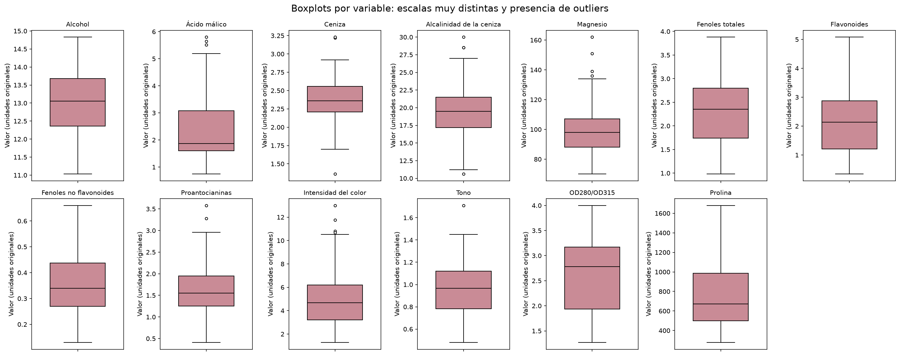 |
|:--:|
| *Figura 1. Boxplots por variable, cada una con su propia escala.* |

- **Outliers moderados:** 17 vinos presentan al menos un valor atípico según el criterio IQR, y 10 según |z| > 3. Se concentran en Ceniza, Magnesio, Alcalinidad de la ceniza e Intensidad del color, y son valores químicamente plausibles.
- **Correlaciones fuertes** en el bloque de polifenoles: Fenoles totales–Flavonoides (r = 0,87), Flavonoides–OD280/OD315 (0,79), Fenoles totales–OD280/OD315 (0,70) y Flavonoides–Proantocianinas (0,65). También Alcohol–Prolina (0,64). Con signo negativo, Tono–Intensidad del color (−0,52) y Flavonoides–Fenoles no flavonoides (−0,54).

| 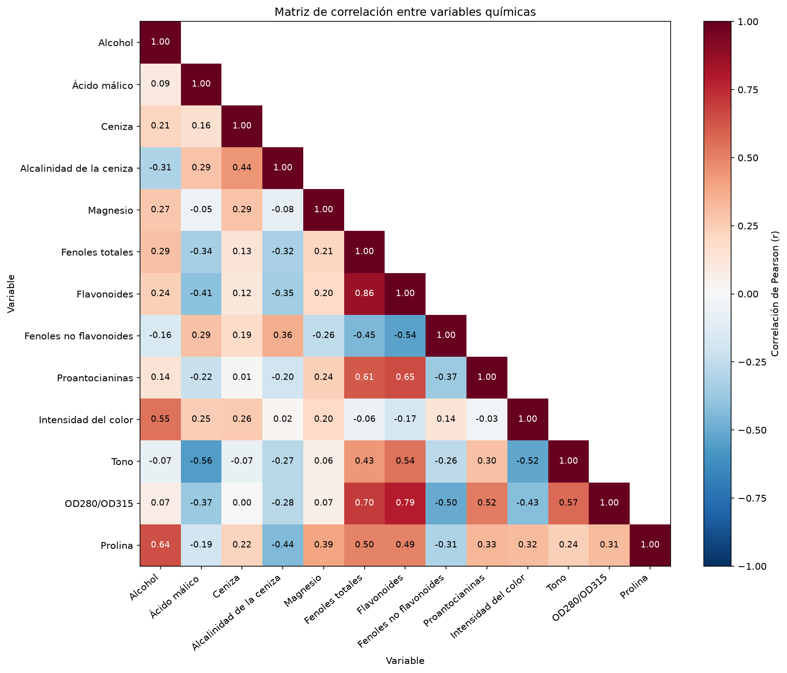 |
|:--:|
| *Figura 2. Matriz de correlación de Pearson.* |

- **Escalas incomparables.** Sin escalar, Prolina concentra el **99,8 % de la varianza total**. En un ejemplo concreto (vinos 0 y 1), Magnesio y Prolina aportan el **97,6 %** de la distancia euclídea al cuadrado entre ambos. Proantocianinas, que casi se duplica entre los dos vinos (2,29 vs. 1,28), aporta solo el 0,1 %. Después de estandarizar, Proantocianinas pasa a explicar el 25,6 % de esa distancia.

| 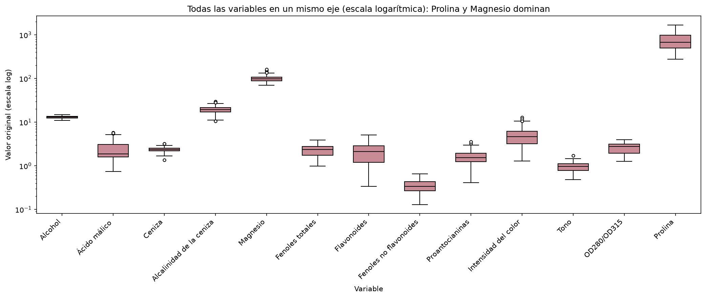 |
|:--:|
| *Figura 3. Todas las variables en un mismo eje, en escala logarítmica.* |

## 3. Metodología (CRISP-DM)

1. **Comprensión del negocio:** objetivo, tipo de problema y decisiones que hay que justificar (distancia, escalado, k y algoritmo).
2. **Comprensión de los datos:** estructura del dataset, nulos, duplicados, distribuciones, outliers por IQR y z-score, correlaciones y pairplot.
3. **Preparación:** comparación de tres escaladores, decisión sobre outliers y justificación de la métrica de distancia.
4. **Modelado:** elección de k con cinco criterios, K-Means final, estabilidad entre semillas, contraste sin escalar y con outliers winsorizados, y clustering jerárquico aglomerativo con seis combinaciones de linkage y métrica.
5. **Evaluación e interpretación:** centroides en unidades originales, perfiles en z-score, ranking de variables por F de ANOVA y PCA con fines exclusivamente de visualización.
6. **Despliegue conceptual:** nombres y fichas de los tipos de vino, con uso comercial sugerido.
7. **Validación post-hoc:** comparación con las etiquetas ocultas mediante ARI, NMI y pureza.

Todo el código está en `src/`, con `random_state=42`. `python -m src.run_all` regenera las 14 figuras y las 23 tablas, y el notebook ejecuta sin errores ni warnings.

## 4. Tabla de decisiones y justificaciones

| Decisión | Alternativas consideradas | Elección | Por qué |
|---|---|---|---|
| **Tipo de problema** | Clasificación supervisada; segmentación por reglas | Clustering (no supervisado) | No hay variable objetivo: la variedad fue eliminada. Los grupos deben surgir de la similitud química. |
| **Escalado** | Sin escalar; MinMaxScaler; RobustScaler | **StandardScaler** (z-score) | Sin escalar, Prolina explica el 99,95 % de la separación entre clusters. StandardScaler es el único que iguala exactamente las dispersiones: el cociente de desvíos es 1, frente a 1,77 con MinMax y 1,42 con Robust. K-Means minimiza varianzas, así que igualarlas da a cada variable el mismo peso a priori. Es también lo que recomienda Guttag (MIT 6.0002). |
| **Outliers** | Eliminarlos; winsorizarlos; RobustScaler | **Conservarlos** | Son moderados (10 vinos con \|z\| > 3) y plausibles. Eliminar los 17 marcados por IQR descartaría casi el 10 % de la muestra. Con los datos winsorizados la partición resulta idéntica (ARI = 1, ningún vino cambia de cluster). |
| **Distancia** | Euclídea; Manhattan; Chebyshev | **Euclídea** (en K-Means) | Es inherente a K-Means: el centroide es la media, y la media minimiza la suma de distancias euclídeas al cuadrado. Manhattan se probó en el jerárquico y no mejoró los resultados (siluetas de 0,25 y 0,19). Chebyshev usa solo la mayor diferencia entre coordenadas y descarta la información de las otras 12 variables. |
| **Cantidad de clusters k** | k = 2 a 10 | **k = 3** | Los cinco criterios coinciden: el codo (la inercia cae 23,0 % de k = 2 a 3 y solo 8,0 % de 3 a 4), la silueta máxima (0,285), Calinski-Harabasz máximo (70,9), Davies-Bouldin mínimo (1,389) y el mayor salto del dendrograma Ward (15,1). Los tamaños son homogéneos y el resultado es consistente con el dominio (tres variedades de uva). |
| **Algoritmo** | Jerárquico con linkage Ward, completo, medio o simple (euclídea); medio o completo con Manhattan | **K-Means** | Tiene la mejor silueta, CH y DB. Es estable (ARI entre semillas ≥ 0,98) y da centroides interpretables, además de escalar mejor que el jerárquico, que es O(n²). Ward coincide con K-Means (ARI 0,85) y funciona como validación cruzada. El linkage simple y el medio fallan: dan grupos de 174/3/1 vinos. |
| **Inicialización** | `init='random'` con una sola corrida | **`k-means++`, `n_init=10`** | Con inicialización aleatoria simple aparecen 5 soluciones distintas en 10 corridas (ARI mínimo 0,865). Con `k-means++` y 10 inicializaciones se obtienen 2 soluciones casi iguales (ARI mínimo 0,982). |
| **Numeración de clusters** | Usar los IDs que devuelve K-Means | **Orden por Prolina descendente** | Los IDs de K-Means dependen de la semilla. Ordenar de forma determinística hace reproducibles los resultados y los nombres. |
| **Nombres** | Asignarlos a mano por número de cluster | **Regla sobre los perfiles z** | La asignación se deriva del perfil químico (por ejemplo, "robusto" es el cluster que maximiza z(Prolina) + z(Alcohol) + z(Flavonoides)) y no del número del cluster. |
| **Visualización** | Pares de variables originales | **PCA con 2 componentes, solo para visualizar** | Resume el 55,4 % de la varianza en un plano. El clustering se hizo sobre las 13 variables completas. |

## 5. Resultados

### 5.1 Elección de k

| k | Inercia (WCSS) | Reducción % | Silueta | Calinski-Harabasz | Davies-Bouldin | Tamaño mín.–máx. |
|--:|--:|--:|--:|--:|--:|:--:|
| 2 | 1658,8 | 28,3 | 0,259 | 69,5 | 1,526 | 87–91 |
| **3** | **1277,9** | **23,0** | **0,285** | **70,9** | **1,389** | **51–65** |
| 4 | 1175,4 | 8,0 | 0,260 | 56,2 | 1,797 | 29–55 |
| 5 | 1109,5 | 5,6 | 0,202 | 47,0 | 1,808 | 26–59 |
| 6 | 1046,0 | 5,7 | 0,237 | 41,7 | 1,554 | 5–53 |

| 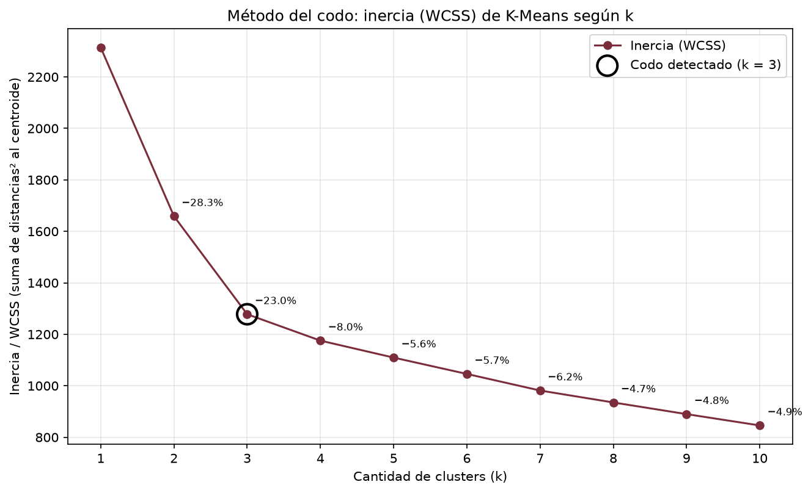 | 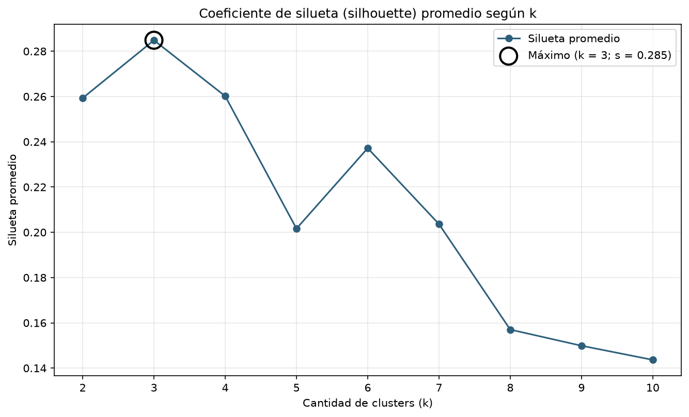 |
|:--:|:--:|
| *Figura 4. Método del codo.* | *Figura 5. Silueta promedio según k.* |

| 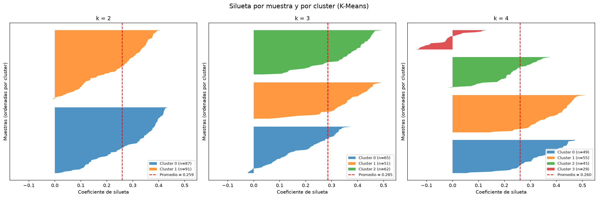 |
|:--:|
| *Figura 6. Silueta por muestra para k = 2, 3 y 4. Con k = 4 aparece un cluster de 29 vinos con muchos valores negativos.* |

| 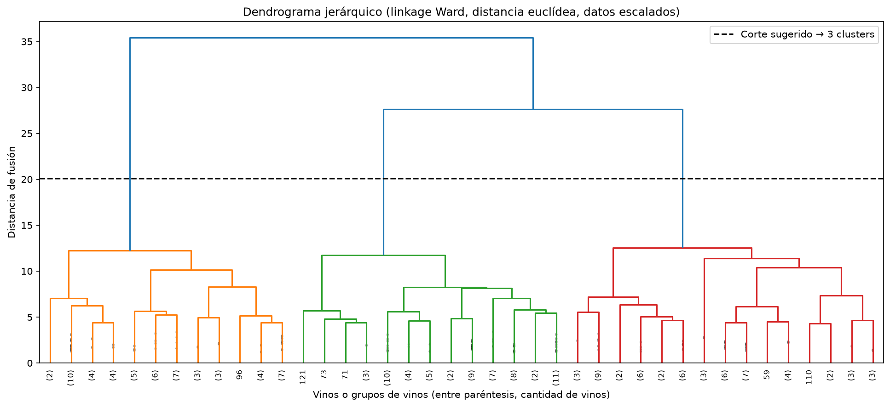 |
|:--:|
| *Figura 7. Dendrograma Ward. Las dos últimas fusiones ocurren a distancias 27,7 y 35,4, y la anterior a 12,6. El corte entre esos niveles deja tres ramas.* |

El valor de la silueta (0,285) indica una estructura **moderada**: son grupos reales pero con cierto solapamiento en 13 dimensiones, algo esperable en datos químicos.

### 5.2 Modelo final y sanidad

Modelo: `KMeans(n_clusters=3, init='k-means++', n_init=10, max_iter=300, random_state=42)`.

| Métrica | Valor |
|---|---|
| Silueta | 0,285 |
| Tamaños | C1 = 62 (34,8 %) · C2 = 51 (28,7 %) · C3 = 65 (36,5 %) |
| Estabilidad (10 semillas, ARI por pares) | media 0,996 · mínimo 0,982 |
| Estabilidad con `init='random'`, `n_init=1` | media 0,959 · mínimo 0,865 |
| K-Means sin escalar vs. escalado | ARI 0,354; Prolina explica el 99,95 % de la separación |
| Outliers winsorizados vs. conservados | ARI 1,000; 0 vinos cambian de cluster |

### 5.3 Comparación con el clustering jerárquico (k = 3)

| Modelo | Silueta (euclídea) | Tamaños | ARI vs. K-Means |
|---|--:|:--:|--:|
| **K-Means** | **0,285** | 65 / 62 / 51 | 1,000 |
| Ward (euclídea) | 0,277 | 64 / 58 / 56 | 0,853 |
| Completo (euclídea) | 0,204 | 69 / 58 / 51 | 0,596 |
| Medio (euclídea) | 0,158 | 174 / 3 / 1 | −0,002 |
| Simple (euclídea) | 0,183 | 174 / 3 / 1 | −0,003 |
| Medio (Manhattan) | 0,252 | 126 / 51 / 1 | 0,487 |
| Completo (Manhattan) | 0,190 | 97 / 52 / 29 | 0,518 |

K-Means y Ward coinciden en 169 de 178 vinos. El linkage simple sufre el **efecto cadena** y, junto con el medio, aísla unos pocos outliers en lugar de separar grupos. Es el caso de "un cluster de 170 y otro de 2" que la cátedra advierte que no sirve. La ventaja del jerárquico es que no exige fijar k de antemano, porque se corta el dendrograma. Sus costos son un tiempo y una memoria de al menos O(n²) y decisiones *greedy*: una fusión no se deshace.

### 5.4 Interpretación

| 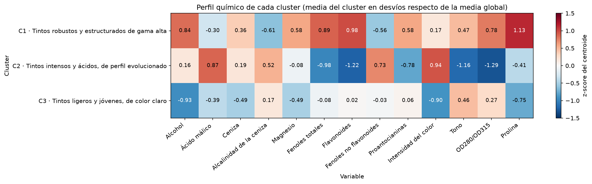 |
|:--:|
| *Figura 8. Perfil de cada cluster en z-score, es decir, en desvíos respecto de la media global.* |

**Centroides en unidades originales**, con las variables principales:

| Cluster | Alcohol | Ác. málico | Fenoles tot. | Flavonoides | Fen. no flav. | Int. color | Tono | OD280/OD315 | Prolina |
|---|--:|--:|--:|--:|--:|--:|--:|--:|--:|
| C1 | 13,68 | 2,00 | 2,85 | 3,00 | 0,29 | 5,45 | 1,07 | 3,16 | 1100 |
| C2 | 13,13 | 3,31 | 1,68 | 0,82 | 0,45 | 7,23 | 0,69 | 1,70 | 619 |
| C3 | 12,25 | 1,90 | 2,25 | 2,05 | 0,36 | 2,97 | 1,06 | 2,80 | 510 |
| *Media global* | *13,00* | *2,34* | *2,30* | *2,03* | *0,36* | *5,06* | *0,96* | *2,61* | *747* |

**Variables más discriminantes** (F de ANOVA): Flavonoides (272), OD280/OD315 (222), Prolina (200), Alcohol (113), Intensidad del color (112) y Fenoles totales (107). Las que menos separan son Ceniza, Magnesio y Alcalinidad de la ceniza.

| 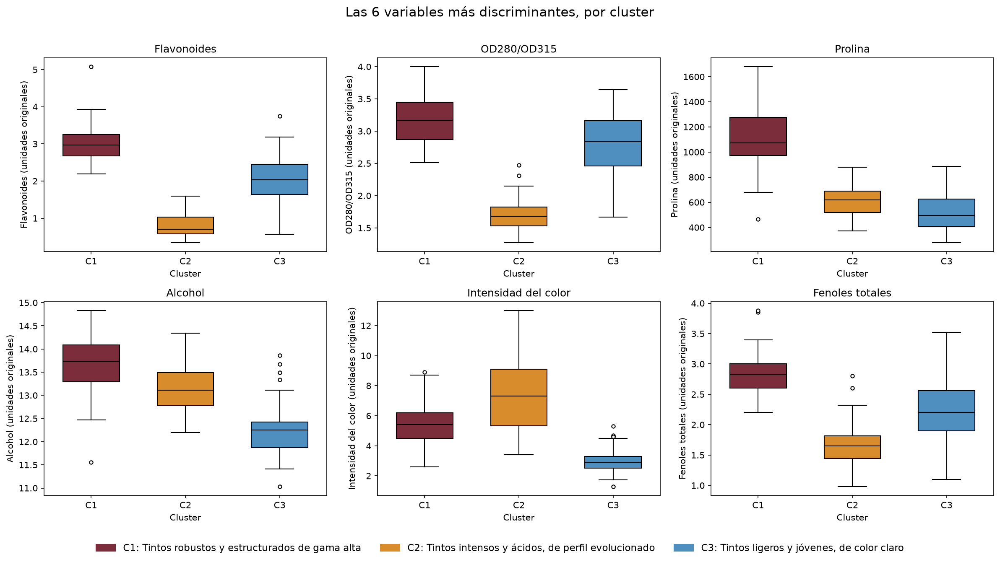 |
|:--:|
| *Figura 9. Las seis variables más discriminantes, por cluster.* |

| 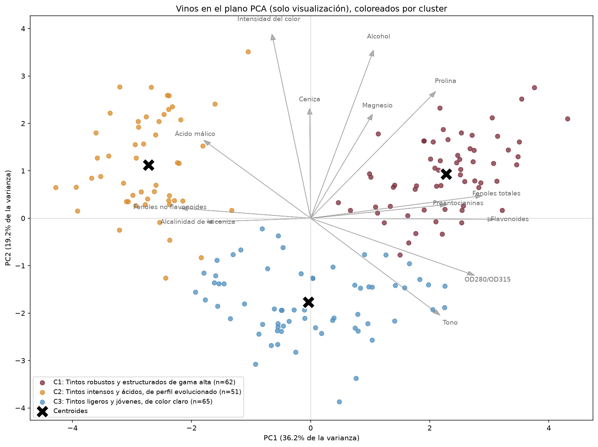 |
|:--:|
| *Figura 10. Biplot PCA (55,4 % de la varianza). PC1 es el eje fenólico y separa C2 de C1. PC2 es el eje de concentración e intensidad y separa C3 de los otros dos.* |

## 6. Los tipos de vino identificados

Los nombres surgen del perfil químico. El perfil sensorial y el uso comercial son **inferencias** a partir de la química, no mediciones.

### C1 · Tintos robustos y estructurados de gama alta (62 vinos)

Es el grupo de mayor graduación alcohólica (13,68 %) y con la Prolina más alta (1.100, frente a una media de 747), dos marcadores de uvas muy maduras. Concentra la mayor carga de polifenoles nobles: Flavonoides 3,00, Fenoles totales 2,85 y Proantocianinas 1,92. Tiene además la menor proporción de Fenoles no flavonoides (0,29). El OD280/OD315 alto (3,16) y un Tono alto (1,07, matices rojos vivos) completan un perfil de vino con cuerpo, taninos de calidad y aptitud para la guarda.

- **Perfil químico dominante:** Prolina 1.100 (z = +1,13) · Flavonoides 3,00 (+0,98) · Fenoles totales 2,85 (+0,89) · Alcohol 13,68 (+0,84) · OD280/OD315 3,16 (+0,78).
- **Perfil sensorial (inferido):** cuerpo pleno, alcohol perceptible, taninos abundantes pero finos y color estable. Potencial de envejecimiento en barrica y botella.
- **Uso comercial (inferido):** segmento premium o reserva. Marida con carnes rojas asadas, caza, guisos y quesos duros estacionados.

### C2 · Tintos intensos y ácidos, de perfil evolucionado (51 vinos)

Tiene la mayor Intensidad del color (7,23) y el Tono más bajo (0,69): un color profundo con matices teja o anaranjados, propios de un vino evolucionado. Es el más ácido, con un Ácido málico de 3,31 frente a una media de 2,34. Sus Flavonoides son los más bajos (0,82), sus Fenoles no flavonoides los más altos (0,45) y su OD280/OD315 es el mínimo (1,70). Su fracción fenólica es, entonces, menos "noble", lo que sugiere taninos más rústicos pese al color intenso.

- **Perfil químico dominante:** OD280/OD315 1,70 (z = −1,29) · Flavonoides 0,82 (−1,22) · Tono 0,69 (−1,16) · Intensidad del color 7,23 (+0,94) · Ácido málico 3,31 (+0,87).
- **Perfil sensorial (inferido):** color oscuro con reflejos teja, acidez marcada y vibrante, y taninos menos pulidos. Es un vino más para consumo temprano que para larga guarda.
- **Uso comercial (inferido):** segmento medio. Acompaña platos grasos o con tomate (pastas, pizzas, embutidos), donde la acidez limpia el paladar.

### C3 · Tintos ligeros y jóvenes, de color claro (65 vinos)

Es el grupo de menor graduación (12,25 %) y de menor Intensidad del color (2,97, frente a una media de 5,06). También tiene la Prolina más baja (510), lo que indica uvas menos concentradas. Su Tono alto (1,06) corresponde a matices rojo-púrpura de vino joven. Sus polifenoles están en valores medios (Flavonoides 2,05) y su acidez málica es baja (1,90). Presenta además el menor contenido mineral (Ceniza 2,23, Magnesio 92,7).

- **Perfil químico dominante:** Alcohol 12,25 (z = −0,93) · Intensidad del color 2,97 (−0,90) · Prolina 510 (−0,75) · Tono 1,06 (+0,46) · Magnesio 92,7 (−0,49).
- **Perfil sensorial (inferido):** cuerpo ligero, color claro y vivo, alcohol moderado y taninos presentes pero poco concentrados. Un perfil fresco y fácil de beber.
- **Uso comercial (inferido):** segmento de entrada o consumo cotidiano, y vino por copa. Marida con aperitivos, carnes blancas y pescados grasos, y puede servirse ligeramente fresco.

**Hipótesis sobre las variedades (no es una conclusión).** En la bibliografía original del dataset (Forina et al., PARVUS), las tres variedades se asocian con **Barolo, Grignolino y Barbera**. Los perfiles obtenidos son consistentes con esa asociación:

- **C1 ↔ Barolo** (Nebbiolo): potente, tánico y de guarda.
- **C2 ↔ Barbera:** acidez alta, color profundo y pocos taninos.
- **C3 ↔ Grignolino:** color pálido y cuerpo liviano.

## 7. Validación post-hoc

> Esta sección **no forma parte del aprendizaje**. La variedad real no intervino en ninguna decisión anterior y en un caso real no estaría disponible. Se sigue el mismo esquema que la cátedra usó con Iris: descartar la especie, clusterizar y comparar al final.

| Cluster | Variedad 1 | Variedad 2 | Variedad 3 |
|---|--:|--:|--:|
| C1 | **59** | 3 | 0 |
| C2 | 0 | 3 | **48** |
| C3 | 0 | **65** | 0 |

| ARI | NMI | Pureza | Vinos fuera de la variedad mayoritaria |
|--:|--:|--:|--:|
| **0,897** | **0,876** | **96,6 %** | 6 de 178 |

| 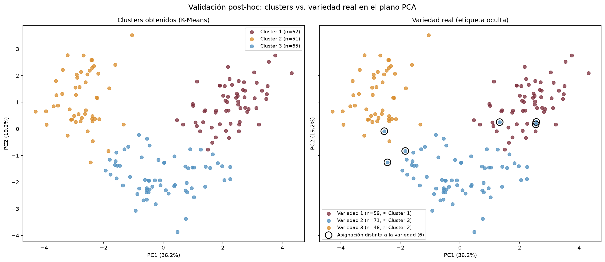 |
|:--:|
| *Figura 11. Clusters obtenidos frente a la variedad real en el plano PCA. Los círculos negros marcan las discrepancias.* |

Las variedades 1 y 3 se recuperan **completas** (59/59 y 48/48). Los 6 errores corresponden a vinos de la variedad 2, la más heterogénea: 3 de ellos caen en C1 y otros 3 en C2, en la frontera del plano PCA. El resultado es más limpio que el obtenido con Iris en clase, donde versicolor y virginica se mezclaban. La correspondencia C1 ↔ 1, C2 ↔ 3 y C3 ↔ 2 coincide con la hipótesis Barolo, Barbera y Grignolino si se asume el orden de la bibliografía.

## 8. Limitaciones

- **Inicialización aleatoria:** el K-Means básico dio 5 soluciones distintas en 10 corridas. `k-means++` y `n_init=10` lo mitigan, pero persisten dos soluciones que difieren en vinos fronterizos.
- **Supuesto de clusters esféricos y de tamaño y densidad similares:** K-Means genera particiones convexas. Aquí funciona porque los grupos son compactos y de tamaños parecidos (51 a 65 vinos), pero fallaría con grupos alargados o de densidades muy distintas.
- **Sensibilidad al escalado:** el resultado depende de una decisión previa. Sin escalar, el modelo agrupa solo por Prolina.
- **Sensibilidad a outliers:** el centroide es una media. En este caso los outliers no alteraron la partición, pero en otros datos podrían hacerlo; K-Medoids o RobustScaler serían alternativas.
- **Solo variables numéricas, y k fijado de antemano.**
- **Redundancia de variables:** el bloque fenólico, con cuatro variables muy correlacionadas, pesa más en la distancia. No se ponderaron ni se seleccionaron variables.
- **Muestra chica y de una sola región:** los nombres describen estos 178 vinos, no a los tintos en general.

**Con más datos o con variables categóricas** (bodega, añada, crianza), se usaría K-Modes o K-Prototypes. DBSCAN serviría para encontrar grupos de forma arbitraria y detectar ruido, y los Modelos de Mezcla Gaussiana (GMM) darían una pertenencia probabilística, útil para los vinos fronterizos. Estas alternativas solo se mencionan; no se implementaron.

## 9. Conclusiones

A partir de 13 mediciones químicas y sin conocer la variedad, el análisis identificó **tres tipos de vino tinto** bien definidos:

- **tintos robustos y estructurados de gama alta** (62 vinos);
- **tintos intensos y ácidos, de perfil evolucionado** (51);
- **tintos ligeros y jóvenes, de color claro** (65).

Las decisiones clave fueron las siguientes. Se estandarizaron las variables, porque sin hacerlo Prolina determina el 99,95 % de la separación. Se conservaron los outliers, que no alteran el resultado. Se eligió k = 3 porque cinco criterios independientes coinciden. El modelo resultó estable entre semillas (ARI ≥ 0,98) y un algoritmo con otra lógica (jerárquico Ward) llegó a una partición equivalente. Las variables que más separan los grupos son Flavonoides, OD280/OD315, Prolina, Alcohol e Intensidad del color. La validación post-hoc confirma que los grupos reproducen las variedades reales con una pureza del 96,6 % (ARI 0,90). En línea con la consigna, el valor del trabajo está en que cada paso se probó, se comparó con alternativas y se justificó.

## 10. Bibliografía

- Aeberhard, S. y Forina, M. (1991). *Wine* [Dataset]. UCI Machine Learning Repository. https://archive.ics.uci.edu/dataset/109/wine
- Forina, M. et al. *PARVUS — An Extendible Package for Data Exploration, Classification and Correlation*. Institute of Pharmaceutical and Food Analysis and Technologies, Génova.
- scikit-learn developers. *sklearn.cluster.KMeans*. https://scikit-learn.org/stable/modules/generated/sklearn.cluster.KMeans.html
- scikit-learn developers. *sklearn.cluster.AgglomerativeClustering*. https://scikit-learn.org/stable/modules/generated/sklearn.cluster.AgglomerativeClustering.html
- scikit-learn developers. *Clustering performance evaluation* (silueta, Calinski-Harabasz, Davies-Bouldin, ARI, NMI). https://scikit-learn.org/stable/modules/clustering.html#clustering-performance-evaluation
- Guttag, J. (2016). *Lecture 12: Clustering*. MIT 6.0002 Introduction to Computational Thinking and Data Science. MIT OpenCourseWare.
- Paul, P. H. y Azcurra, J. *Unidad 2: Clasificación, Clustering y Reglas de Asociación* (diapositivas y videos, partes 1 a 6) y notebook `prueba-iris.ipynb`. Aprendizaje Artificial, Maestría en IA, CAECE.
